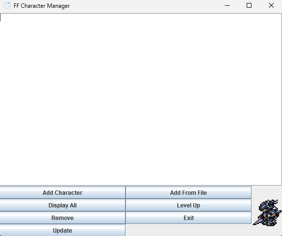
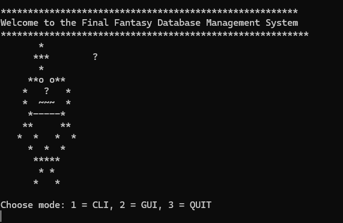

# Final Fantasy Character Management System 🎮⚔️

A comprehensive character management system inspired by Final Fantasy, featuring dual interfaces (CLI and GUI), SQLite database integration, and full CRUD operations for managing your party roster. Built as a database integration project for CEN3024C.


## 🎯 Project Overview

This project demonstrates the transition from in-memory ArrayList storage to persistent SQLite database management, while maintaining clean separation between business logic and user interface layers. The system supports both command-line and graphical interfaces, showcasing flexible architecture design.

---

## ✨ Features

### Core Functionality
- ✅ **Create Characters**: Add characters manually or batch import from CSV files
- ✅ **Read/Display**: View all characters with complete stats and party status
- ✅ **Update**: Modify character attributes (name, job, level, HP) with validation
- ✅ **Delete**: Remove characters with confirmation prompts to prevent accidents
- ✅ **Level Up System**: Automatic HP calculation and stat updates on level increase

### Dual Interface Support
- 🖥️ **Command Line Interface (CLI)**: Terminal-based interaction for power users
- 🖼️ **Graphical User Interface (GUI)**: User-friendly Swing interface with visual feedback

### Data Management
- 💾 **SQLite Database**: Persistent storage with ACID compliance
- 📁 **File Import**: Batch character creation from CSV files
- ✔️ **Input Validation**: Comprehensive validation at all layers
- 🎭 **Job System**: 28+ authentic Final Fantasy job classes with validation
- 🔍 **Real-time ID Validation**: Database lookups prevent invalid operations

### Visual Features
- 🎨 **Random Job Icons**: Dynamic rotation of 11 hand-picked Final Fantasy job class icons
- 🖼️ **Custom App Icon**: Branded application icon
- 📊 **Scrollable Output**: Clean display of character roster

---

## 🖼️ Screenshots

### GUI Interface

*Graphical interface featuring button controls, character display area, and rotating job icons*

### CLI Interface

*Command-line interface with menu-driven navigation*

---

## 🚀 Installation

### Prerequisites
- Java 17 or higher
- SQLite JDBC Driver (included)

### Quick Start

1. **Clone the repository**
```bash
git clone https://github.com/yourusername/ff-character-management.git
cd ff-character-management
```

2. **Configure database path**
    - Open `DBHelper/PCharacters.java`
    - Update line 8:
```java
private final String DATABASE_PATH = "your/path/to/ffgame.db";
```

3. **Compile**
```bash
javac -d bin src/FFPackage/*.java src/DBHelper/*.java
```

4. **Run**
```bash
java -cp bin FFPackage.Main
```

5. **Choose your interface**
```
Choose mode: 1 = CLI, 2 = GUI, 3 = QUIT
```

---

## 📘 Usage Guide

### CLI Mode

**Main Menu:**
```
1. Add character manually
2. Add characters from file
3. Display all characters
4. Level up character
5. Remove character
6. Update character
7. Exit
```

**Example Workflow:**
```
Choose: 1
Name: Cloud Strife
Job: Warrior
Level: 50
HP: 9999
Is the character in your party? (yes/no): yes
✓ Character added!
```

### GUI Mode

**Operations:**
- **Add Character**: Dialog-based character creation
- **Display All**: View entire roster in scrollable text area
- **Level Up**: Enter ID and level increment with validation
- **Update**: Menu-driven attribute modification
- **Remove**: Confirmation dialog with ID validation
- **Add From File**: File chooser for CSV import

### CSV Import Format
```csv
Cloud Strife,Warrior,50,9999,true
Aerith Gainsborough,White Mage,45,7500,true
Tifa Lockhart,Monk,48,8800,false
Barret Wallace,Gunner,52,10500,true
```

**Format:** `Name,Job,Level,HP,IsActive(true/false)`

---

## 📁 Project Architecture
```
FFCharacterManagement/
├── src/
│   ├── FFPackage/
│   │   ├── Main.java              # Entry point - mode selection
│   │   ├── FF.java                # Business logic layer
│   │   ├── PCharacter.java        # Character model & validation
│   │   ├── FFCLI.java             # CLI implementation
│   │   └── FFGUI.java             # GUI implementation (Swing)
│   └── DBHelper/
│       └── PCharacters.java       # Data Access Layer (DAO)
├── resources/
│   └── images/
│       ├── app_icon.png           # Application icon
│       └── [11 job icons]/        # astrologian, bard, black_mage, etc.
├── ffgame.db                      # SQLite database
└── README.md
```

### Design Pattern: Layered Architecture
```
┌────────────────────────────────────┐
│   Presentation Layer               │
│   • FFCLI.java (Scanner-based)     │
│   • FFGUI.java (Swing-based)       │
└─────────────┬──────────────────────┘
              │ calls methods
┌─────────────▼──────────────────────┐
│   Business Logic Layer             │
│   • FF.java (game rules, logic)    │
│   • PCharacter.java (validation)   │
└─────────────┬──────────────────────┘
              │ queries data
┌─────────────▼──────────────────────┐
│   Data Access Layer                │
│   • PCharacters.java (SQL queries) │
└─────────────┬──────────────────────┘
              │ persists to
┌─────────────▼──────────────────────┐
│   Database (ffgame.db - SQLite)    │
└────────────────────────────────────┘
```

**Key Design Decisions:**
- **Separation of Concerns**: UI code never touches database directly
- **Single Responsibility**: Each class has one clear purpose
- **Interface Agnostic**: Business logic works with any UI (CLI/GUI/future web)
- **No UI in Business Logic**: FF.java has no Scanner or JOptionPane code

---

## 🗄️ Database Schema

**Table:** `characters`

| Column   | Type    | Constraints  | Description                      |
|----------|---------|--------------|----------------------------------|
| id       | TEXT    | PRIMARY KEY  | Auto-generated 4-digit ID        |
| name     | TEXT    | NOT NULL     | Character name                   |
| job      | TEXT    | NOT NULL     | Job class (28+ valid options)    |
| level    | INTEGER | NOT NULL     | Character level (1-99)           |
| hp       | REAL    | NOT NULL     | Hit points (can be decimal)      |
| isActive | INTEGER | NOT NULL     | Party member? (0=no, 1=yes)      |

**Sample Query:**
```sql
SELECT * FROM characters WHERE level > 50 AND isActive = 1;
```

---

## 🛠️ Technologies & Techniques

**Core Technologies:**
- Java 17 (OOP, Collections, Exception Handling)
- SQLite 3 (ACID transactions, indexed queries)
- JDBC (PreparedStatements, ResultSets)
- Swing (Event-driven GUI, layouts)

**Design Patterns:**
- Layered Architecture (3-tier)
- Data Access Object (DAO)
- Model-View Separation

**Best Practices:**
- Try-with-resources for automatic cleanup
- PreparedStatements to prevent SQL injection
- Input validation at multiple layers
- Defensive programming (null checks, bounds checking)

---

## 📚 Key Learning Outcomes

### Database Transition
Starting with ArrayList storage, I successfully transitioned to SQLite:
- Learned SQL query construction and optimization
- Implemented PreparedStatements for security
- Understood the importance of data persistence
- Managed database connections efficiently

### OOP Principles Applied
- **Encapsulation**: Database access hidden behind DAO pattern
- **Separation of Concerns**: UI logic separate from business logic
- **Single Responsibility**: Each class/method has one job
- **DRY Principle**: Reusable methods across CLI and GUI

### Problem Solving
- Debugged ArrayList/Database sync issues
- Implemented fail-fast validation to improve UX
- Handled edge cases (empty inputs, invalid IDs, closed dialogs)
- Created robust error messages for user guidance

### Interface Design
- Built two completely different UIs using same backend
- Learned Scanner vs JOptionPane paradigms
- Implemented input validation loops
- Added visual feedback (confirmation dialogs, status messages)

---

## 🎨 Cool Feature: Random Job Icons

One of my favorite features is the **dynamic job icon rotation**:
```java
private ImageIcon getRandomJobIcon() {
    String[] jobImageNames = {
        "astrologian.png", "bard.png", "black_mage.png", 
        "dark_knight.png", "dragoon.png", "monk.png", 
        "paladin.png", "scholar.png", "summoner.png", 
        "warrior.png", "white_mage.png"
    };
    String name = jobImageNames[new Random().nextInt(jobImageNames.length)];
    return new ImageIcon(getClass().getResource("/images/" + name));
}
```

The icon changes whenever you perform an action, adding visual variety and staying true to the Final Fantasy aesthetic! ⚔️

---

## 🚧 Future Enhancements

Potential features for v2.0:
- [ ] **Search/Filter**: Find characters by name, job, or level range
- [ ] **Party Management**: Drag-and-drop party composition
- [ ] **Equipment System**: Add weapons, armor, materia
- [ ] **Battle Simulator**: Test party effectiveness
- [ ] **Export Reports**: Generate PDF character sheets
- [ ] **Statistics Dashboard**: Charts showing job distribution, average levels
- [ ] **Themes**: Light/dark mode toggle
- [ ] **More Job Icons**: Expand to all FF job classes

---

## 🐛 Known Issues

- GUI update dialog doesn't refresh character display automatically (requires manual Display All)
- No undo/redo functionality for destructive operations
- CSV import doesn't validate duplicate IDs

---

## 📝 Course Information

**Course:** CEN3024C - Software Development I  
**Institution:** Valencia College  
**Topic:** Database Integration & OOP Design  
**Semester:** Junior

**Project Requirements Met:**
- ✅ Database persistence (SQLite)
- ✅ CRUD operations (Create, Read, Update, Delete)
- ✅ File I/O (CSV import)
- ✅ Input validation
- ✅ Exception handling
- ✅ Professional documentation

---

## 👤 Author

**Raphael**
- GitHub: [@RaphT197](https://github.com/RaphT197)
- Email: rtabrunhosa@gmail.com

---

## 🙏 Acknowledgments

- **Final Fantasy Series** (Square Enix) - For decades of inspiration
- **CEN3024C Course Materials** - For database integration guidance
- **SQLite Community** - For excellent documentation
- **Java Swing Tutorials** - For GUI design patterns

---


## 🌟 Show Your Support

If you found this project interesting or helpful:
- ⭐ Star this repository
- 🍴 Fork it for your own learning
- 📝 Open issues for suggestions
- 🤝 Contribute improvements

---

**Built with ☕ and passion for Final Fantasy by Raphael**